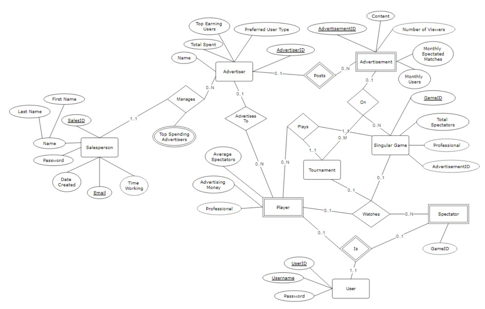

# Database Design Project Submission Template
## CS 3200 - Fall 2023

## Directions:
- One group member should make a copy of this template and share it with other team members so they can edit it as well. 
- Complete all the sections on the subsequent pages.
- Set up Sharing for TAs and Dr. Fontenot. Owner of the file needs to:
  - Click the share button located in the top right of the document. 
  - At the bottom of the modal under General Access, click the drop down and choose Anyone with Link.  
  - In the drop down that appears to the right, choose Commenter. 
  - Click the Copy Link button
  - Paste the link where indicated at the bottom of this page. 
- Download a **PDF** of this document (File Menu > Download > PDF Document).
- Submit the **PDF** to Gradescope. 
  - Submission on Gradescope will be by group. 
  - The team member submitting needs to indicate/choose all team members during the submission process. If you do not do this, grades will not get properly synced with Canvas.
  - Be sure to associate the submission item with what page it appears on in your PDF (as you’ve done with other assignments in the past).
 
Please note, your group can take creative liberties with the look and feel of this document. You can change the fonts, colors, etc.  However, please leave the information in the same order as it is in this document.

Link to your group’s copy of this Google Doc:
[Click here!](https://docs.google.com/document/d/1JkYiilohD8QWpZYltNomIjqqRL3aEUH2U6vaHz8NBIc/edit?usp=sharing)

## Part 1: Team and Project Info
| Team Name:            | Checkmate Check-in Crew |
|-----------------------|-------------------------|
| Product/Project Name: | ChessVaultDB            |

Team Members:
|                           | Name (as appears on Canvas): | Northeastern Email Address:       |
|---------------------------|------------------------------|----------------------------------|
| **Member 1 (Point Person)** | Luke Wisner                 | wisner.l@northeastern.edu        |
| **Member 2**                 | Maxim Izosimov              | izosimov.m@northeastern.edu      |
| **Member 3**                 | Rahul D’Mello               | dmellokamath.r@northeastern.edu  |
| **Member 4**                 | Ildi Hoxhallari             | hoxhallari.i@northeastern.edu    |

## Part 2: Brief Synopsis of Project/Product
We will design an online chess application that stores user data and hosts games between players, similar to Chess.com. The database will store account information for the users including username, 
password, wins, losses, rank, and other player information. The database will also have accounts for admins that maintain the application and handle data information. In addition, we want to extend the 
scope of the application to allow for companies to place ads on the website and for players to open up their games to spectators.

## Part 3: User Personas
### Persona 1: Players 
Hikaru, a 35-year-old data analyst from Japan, seamlessly blends his professional expertise with a deep-rooted love of chess. His weekdays are dedicated to data patterns and algorithms, while evenings and 
weekends find him teaching chess tactics to budding players or pondering over chess boards at local tournaments. As a player, he's known for his meticulous style and strategic foresight, always analyzing 
past games and potential moves with a critical eye. Driven by a quest for continuous improvement, Hikaru embodies the spirit of a lifelong chess student and mentor, aspiring to the mastery and precision 
of a grandmaster.

### User Stories for Persona 1:
As Hikaru, I would want the following features in my chess app/ website:
- I would like to retrieve my past games, so I can analyze my play history and track my progress over time. It provides a good way for me to study my wins and losses, so I can improve my strategies.
- I would like to view detailed statistics and analytics of my performances, such as win percentages, highest ELO ratings broken down by game type, draw rates, and wins broken down by endgames, and losses. This data would help me pinpoint my strengths to leverage against my opponents and my weaknesses to address in my gameplay.
- I would also like to compare my rankings and ratings against opponents to understand how my skills measure up in the broader chess community. Understanding my ELO helps me tailor my training to climb the ranks.
- I would also like to connect and engage with a community of players within the database. The ability to share insights, follow players, challenge others, and receive feedback is essential for growth and staying motivated in the competitive world of chess.

### Persona 2: Admin/Moderators
Alice works as an admin. Her job is to keep the application in good shape and to handle the data information related to the users, the games, and the viewers. She uses a dashboard that lets her see, change, and remove any data in the database. She also checks the performance and security of the application, and solves any technical problems that might happen.

Alice’s main goal is to make sure the application is high-quality and functional, and to offer a good experience for the users. She wants the application to work well, without any glitches, errors, or breaches. She also wants to organize the data in the database effectively, without any redundancy, inconsistency, or loss. Finally, she wants to be able to respond to any user complaints or requests, and to fix them quickly and effectively.

Alice’s main challenges are to cope with technical problems, security breaches, user complaints, and data management. She faces challenges such as repairing bugs, stopping cheaters, moderating users, and improving data. She has to meet the needs and expectations of the users, the advertisers, and the viewers.

### User Stories for Persona 2:
As an admin, I want to be able to monitor the performance and security of the application, so that I can ensure the quality and functionality of ChessVaultDB.
- I need to be able to check the availability of the application regarding whether it is online and accessible to users. 
- I also need to be able to protect the application from any external threats, such as cheaters based on player statistics (i.e. account flagging based on suspicious activity). 
- I need to have the tools to troubleshoot any technical problems that might arise, and to report and document them accordingly for later reference.
As an admin, I want to be able to handle any user complaints or requests, so that I can provide a satisfying experience for the users.
- I need to be able to communicate with the users, and to listen to and understand their feedback, suggestions, or concerns. This includes resolving user issues that were submitted to me in the form of a report. I need to be able to respond to their requests in a timely manner, and to resolve them effectively. 

### Persona 3: Spectators
Simon is a 27-year-old chess enthusiast and a frequent visitor of chess websites, where he enjoys watching live tournaments and analyzing completed games. He has an appreciation for the game's history and enjoys following the careers of grandmasters. Simon is not an active competitor; instead, he prefers the role of a spectator, studying moves and strategies from players around the world. He works as a software developer, which means he likes good website interfaces that provide clear instructions and is where things can be easily found, like previous games and statistics. Although Simon rarely posts in forums, he is an active member of the online chess community and relies on real-time updates and notifications about upcoming matches. His ideal chess website is one that combines comprehensive databases of past games with the ability to watch live events and delve into detailed analyses of each move.

### User Stories for Persona 3:

As Simon, I would want the following four features on my chess website:
- As someone who values the historical and analytical aspects of the game, I want to access a library/archive of other players’ past games so that I can study various players whenever I feel like it.
- In addition, I desire a feature that allows me to follow my favorite grandmasters, where I can also observe their statistics, enabling me to stay connected to their progress.
- As Simon, I want to be able to bookmark games I find interesting so that I can easily return to them later for further study or entertainment. This feature should allow me to save games directly and organize them in my personal profile for quick access.
- I am looking for a community feature where I can read discussions and opinions from other chess fans, enhancing my understanding of the game and engaging with the content at a deeper level, even though I may not actively participate in the discussions.

### Persona 4: Sales

Mark works for ChessVaultDB as a sales associate with the goal of growing the user base and finding companies that want to advertise on the website. Mark has been a part of the company since its founding, so he’s very motivated to see it succeed. Finding advertisers is a large component of the company’s success because a monetized platform can grow even more. With an added revenue stream, they can hire more developers, admins, and other employees to expand the scope of the website and eventually grow the player base.

Mark wants the ability to get the number of spectators per online game, and also determine when certain users are “professionals,” which would be any player who gets many spectators and rewatches for their matches. These players could be highly ranked chess players like grandmasters or international masters, live streamers who stream their games of chess online, or anyone else who has lots of spectators for their games. Mark wants to acquire spectator data, so that he can send it to advertisers with correlated prices so that the higher watched games have higher prices because more people will be seeing their advertisements.

### User Stories for Persona 4:
- I want to sell screen space on ChessVaultDB to advertisers so that the company can begin making a profit. In order to sell to advertisers, I will need to delineate the games into two separate types: casual and professional. Casual games will be the most common on the website. Any game of normal users playing without spectators would be considered a casual game. A professional game would be any game that has many spectators or involves a user that is a “professional.” These users should be marked within the database for easy recall, and their past games should be flagged to record the number of users who go back and watch them.
- I want to have access to spectator data for certain games, so that I can sell it better to advertisers. If the advertisers can get the average number of spectators that a specific user garners when they play, they can tell exactly how large their target consumer audience is. That data will make it easier to set prices and also sell the platform to prospective companies. Companies should also have the option to buy screen space across multiple games for casual users, so even though only two players would be seeing the ads, it would be much cheaper and in higher quantities.
- I want to have access to a list of advertisers, which users they advertise to, how much they have spent on those advertisements, and if they prefer to advertise to professionals, casuals, or a mix of both. This will help ChessVaultDB determine their biggest clients.
- I want to get a list of the users that are advertised to, so that ChessVaultDB can determine the users that bring in the most revenue and eventually pay them in return.

## Part 4: Localized ER Diagrams
### User Persona 1: (Hikaru the Player)

### User Persona 2: (Alice the Admin)

### User Persona 3: (Simon the Spectator)

### User Persona 4: (Mark the Salesman)

## Global ER Diagram
### Paste your app’s global ER diagram below. 

## Relational Diagram:
### Paste your app’s relational diagram (generated from the above global ER diagram) below. 

## Datagrip Database Diagram
### After you create your database script file, generate a database diagram in Datagrip.  Screenshot or export and paste below. 

